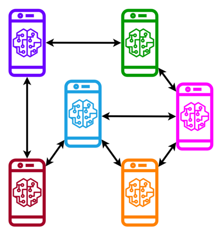
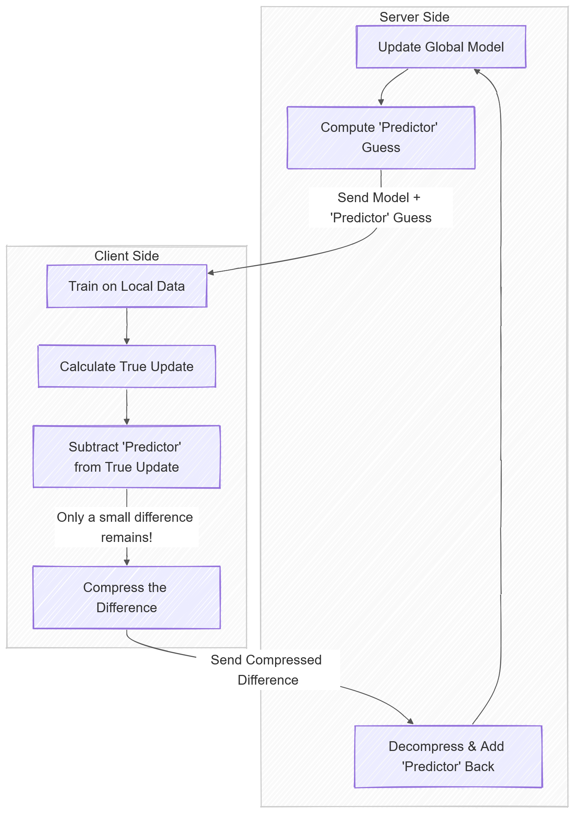
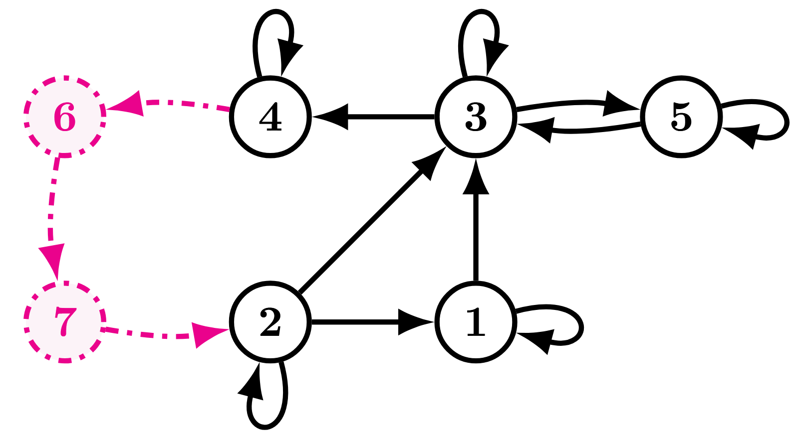

  
  
  <h1>Tomàs Ortega</h1>
  
  

    <b>PhD Candidate</b> 
    Electrical Engineering and Computer Science 
    University of California, Irvine
  

  

    
    
    
    
    
    
  

   
  

  <a href="https://tomasortega.github.io/CV.pdf" class="btn-cv">Check out my CV!</a>
  

   
  

Originally, I am from Sant Cugat (near Barcelona) but I've lived in Madison, Pasadena, Irvine, and now in Philadelphia.

My doctoral advisor is [Hamid Jafarkhani](https://www.ece.uci.edu/~hamidj/), and I have previously been at NASA's JPL with [Marc Sanchez-Net](https://scholar.google.com/citations?user=0C0EdK8AAAAJ&hl=en), at the Vector Institute with [Xiaoxiao Li](https://xxlya.github.io/), and at Nokia Bell Labs (Murray Hill) with [Sahil Tikale](https://www.nokia.com/people/sahil-tikale/).

Before joining UCI, I graduated from Universitat Politècnica de Catalunya with a double degree in Mathematics and Electrical Engineering as part of the [CFIS program](https://cfis.upc.edu/en), and a MS in [Advanced Mathematics and Mathematical Engineering](https://mamme.masters.upc.edu/en), focused on discrete mathematics and information theory.

For my undergrad thesis I worked with the Communications Architectures and Research Section at [NASA's Jet Propulsion Laboratory](https://www.jpl.nasa.gov/), helping build the next-generation space radios.

# Research interests

My research is focused on making distributed algorithms work in communication-constrained networks, with an emphasis on privacy-preserving Machine Learning. I derive theoretical bounds and demonstrate my results with practical implementations. This includes algorithms for Federated Learning and Decentralized Control.

More broadly, I am interested in optimization, information theory and AI.

# Some highlighted projects

### Decentralized Online Learning without Learning Rates

Tuning learning rates is a major pain point in online learning.
In the decentralized setting, this problem is worse nodes have to coordinate between them.

In [this work](https://arxiv.org/abs/2510.15644), we proposed a method to perform decentralized online learning without learning rates, and with sublinear network regret bounds.
To achieve this, we extended the [*parameter-free* framework from Francesco Orabona and Dávid Pál](https://arxiv.org/abs/1602.04128) with a gossip consensus scheme.
We also developed a new betting-function framework inspired by this work, which is more amenable for analysis, and which we believe is of independent interest.

We found that our analysis needed a linear gossip schedule (in learning round *t*, we perform *t* rounds of gossip) to achieve sublinear regret bounds, which is impractical. However, in practice, we can get away with a constant number of gossip rounds in all our experiments.
We conjecture that the linear gossip schedule is an artifact of our analysis, and that a constant gossip schedule is sufficient, but proving this is an open problem.

The code for this project is available [here](https://github.com/TomasOrtega/Deco).

  

  

    Decentralized learning. Each node can only communicate with its neighbors, and there is no central server.
  

### Privacy-preserving Error Feedback for Distributed Learning

Practical distributed learning often uses biased aggressive compression for communication from the clients to the server. However, to guarantee convergence, we need client-specific control variates to perform error feedback.

Individual control variates kill privacy guarantees, and do not scale with the number of clients. To fix error feedback, we proposed [a framework](https://arxiv.org/abs/2512.22623) that leverages previous *aggregated* client updates for feedback. This allows highly aggressive compression without the privacy and scale issues that come with client-specific control variates. The open-source code is available [here](https://github.com/TomasOrtega/CAFe).

<!-- [](https://mermaid.live/edit#pako:eNp1lE2P0zAQhv-KMRJ7oF01SRPSHJDYVOxlV6yUAhLNHtx4klp17MpxgG7b_84k7icLk4s983jm9XiULS00B5rQyrD1ksymuSJoTbtwjgzMTzAkExxcpLPMm39dc2aB3Eu9YJI8Yg75TIbDjyT15qmu1y0Gb54McFFYbW7IfQtN83yRwp9PoUDQoJ-8I584v-LvWLG6wvvkmedcoHiu_lKaSgHK9krJ-WDqdQd3GZ5wKsn717p2JPXnM8OEIlqRB13glabMsgsBqROQBvOUyaKV3eVnpgXiGnFJBo4cz7N2YQ0r7FXB0uj6fyfHvdYvSm4II03NpCRclCUYUAUQAzUqbN6g2rDvcd86uwQyPUGX2cLzzY808At2h129aGe3oAOcA8FpYlHggNZgsCRu6baL5xSL1ZDTBJccStZKm9OBC0m20a11MZCrs1_rlfMumeJTw36pU6xP940ZwRYSmo7aHvXntNTKZuLlUM4br4-1zuHvIKrloeZCS_4K-MxqITcOaJhqhg0YUV5hhWwbC-ZuVTnsbTnpvn8y2nAwB6zo7QqTQkGqpT4iYW9XCPAKHtgCZDffldEtdp4mXdXecurQfa72-BZrpn5oXR-fA_FqSZOSyQZ3bT8-U8Fw_OuTF18WNaaY2NJkMvL7JDTZ0t808aPRbRSH4zAMfN-PwmhANzTxgts48EM_9rxx4MXxON4P6EtfdnQ78fyJN_EjP4gmoRd_GOANBM7xo_tpFFqVoqL7P1bhS1Q) -->

<!-- [](https://mermaid.live/edit#pako:eNp1lE1v2zAMhv-KpgHrYUkQy3Ga-DBgdbBeWmyAsw1Y3INi0Y4QWQpkeVua5L-PtpqvdaMvFvmQfEUT3tHcCKAxLS3frMh8lmmCVjdL70jB_gRLUinAR1pLg8XXjeAOyL0yS67II9ZQT6Tf_0CSYJGYatNg8OaLBSFzZ-wNuW-grp8uSrDFDHIELfrJO_JRiCv-jufrK7wrngbeBVpk-i-liZKgXaeUnBOToE3cp5jhVZL3r3XtScIWc8ulJkaTB5PjlWbc8QsBiReQhIuEq7xR7eXntgHiB3FJhp4cLdJm6SzP3VXDwprqf5mjTutnrbaEk7riShEhiwIs6ByIhQoV1m9QbdTNuBudWwGZnaDLatH55kcaxAW7x6lejLN9oT3cAylo7FBgj1ZgsSUe6a6NZxSbVZDRGF8FFLxRLqM9H1LGrH1kxbWYWf5Ln2Jd2jduJV8qqFtqd9SZ0cJol8rnl7LBaHOseQ5_B1munAeWRolXwCdeSbX1QM113a_ByuIKy1VTO7B369Jjb4tp-_yTMVaAfcHyzq4wJTUkRpkjEnV2hYAo4YEvQbV7XFrT4IRp3HbtLKMePWT6gDPfcP3DmOo4dsTLFY0Lrmo8Nd2azCTHNa9OXvyCqDHBwo7GwXDMuio03tHfNGbj4WA8iUZRFDLGxtG4R7dIhYNJyCI2CYJRGEwmo8mhR5-7vsPBNGDTYBoFQxbesim77eEVJC7so_875EYXsqSHP1bURBU) -->

  

  

    Compressed aggregate error feedback block diagram.
  

### Truly decentralized learning on directed graphs

Decentralized optimization algorithms typically require communication between nodes to be bi-directional.

In the directed case, existing algorithms required nodes to know how many listeners they have (knowledge of their out-degree). We proposed a [series of works](https://github.com/TomasOrtega/DT-GO) that circumvent this requirement.

A nice property of this framework is that it naturally accomodates networks with delays, as one can add imaginary nodes to the network to model delays, and use the same analysis to obtain convergence guarantees.

Currently, I'm interested in incorporating more aspects of real networks to bridge the gap between the practice and theory of decentralized learning.

  

  

    An example of a directed graph with delays. The imaginary nodes (dashed) model delays in communication.
  

### Proving stuff with Lean

On the side, I enjoy theorem proving with Lean. In the future I would like to formalize more of my proofs using Lean.
I used to organize a group for people in the greater LA area to learn how to write mathematical proofs in Lean.
I have contributed to [Compfiles](https://github.com/dwrensha/compfiles/pull/65), [Sphere-Packing](https://github.com/thefundamentaltheor3m/Sphere-Packing-Lean/pull/134), and [OrderedSemigroups](https://github.com/ericluap/OrderedSemigroups), among others.

  

### Error correcting codes from Generalized Quadrangles

Together with Simeon Ball, we developed [a method](https://arxiv.org/pdf/2405.20524) to construct point-line incidence matrices for Generalized Quadrangles in polynomial time (polynomial to the 4th, 6th and 11th power for different GQs but hey, still better than existing exponential methods).

This allowed us to construct [the largest point-line GQ incidence matrix repository](https://github.com/TomasOrtega/QuasiCyclicGQs) that currently exists.
But, better than that, these point-line incidence matrices are quasi-cyclic!
This is a really desireable property if you want to construct error correcting codes from GQs, which achieve a very good error rate to round of belief propagation decoding ratio.
The repository also has [.alist](https://www.inference.org.uk/mackay/codes/alist.html) matrices to easily run LDPC simulations.

  

  

    Visualization of GQ(2,2).
  

### Maintaining communication while entering the Martian atmosphere

During the Entry, Descent and Landing (EDL) phase of rover missions to Mars, the communications are lost due to the large Doppler shift caused by the spacecraft dramatically decelerating when hitting the Martian atmosphere.
During my time at JPL, we proposed [a system](https://ieeexplore.ieee.org/document/9438418) to enable us to track this shift in Doppler and maintain comms throughout.

This system will be implemented in the next generation of NASA's spacecraft radios.

As a part of this line of work, we derived an analytical approximation for Phase-Locked Loops frequency error standard deviation, which is of independent interest.

  

  

    Mars EDL. Our system will help most in the Peak Deceleration phase.
  

### If you made it this far

Here is a [Snake game](https://github.com/TomasOrtega/JavaSnake) I coded in Java.
